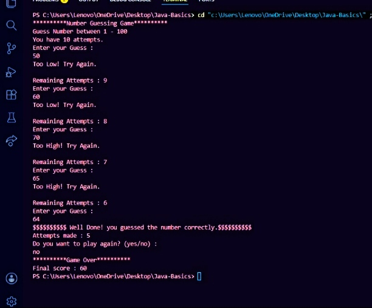
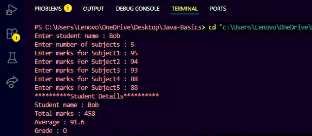

# DecodeLabs-Internship
# Java Internship Projects

This repository contains the projects that I completed during my Java Programming Internship. These projects helped me improve my understanding of Java fundamentals and gave me hands-on experience in developing console-based applications.

---

## Project 1: Number Game

### Description

The Number Game is a simple Java application where the computer generates a random number and the user tries to guess it. The program provides hints to help the user reach the correct answer.

### Features

* Random number generation
* User input through Scanner
* Hint messages for incorrect guesses
* Score calculation
* Multiple attempts

### Concepts Used

* Variables and Data Types
* Loops
* Conditional Statements
* Random Class
* User Input Handling

### Output

----------------------------------------------------------------------------------------------------------------------------------

## Project 2: Student Grade Calculator

### Description

The Student Grade Calculator is a Java program that calculates the total marks, average percentage, and grade of a student based on marks entered for multiple subjects.

### Features

* Accepts marks for multiple subjects
* Calculates total marks
* Calculates average percentage
* Assigns grades based on performance
* Displays results in a clear format

### Concepts Used

* Scanner Class
* Loops
* If-Else Statements
* Arithmetic Operations
* Type Casting

### Output

------------------------------------------------------------------------------------------------------------------------------------

## Tools Used

* Java
* JDK
* Visual Studio Code
* GitHub

## What I Learned

Through these projects, I gained practical experience in:

* Writing Java programs
* Working with user input
* Implementing program logic
* Using loops and conditional statements
* Building simple console-based applications

----------------------------------------------------------------------------------------------------------------------------------

## Author

T.K. Charunetra

Java Programming Intern
