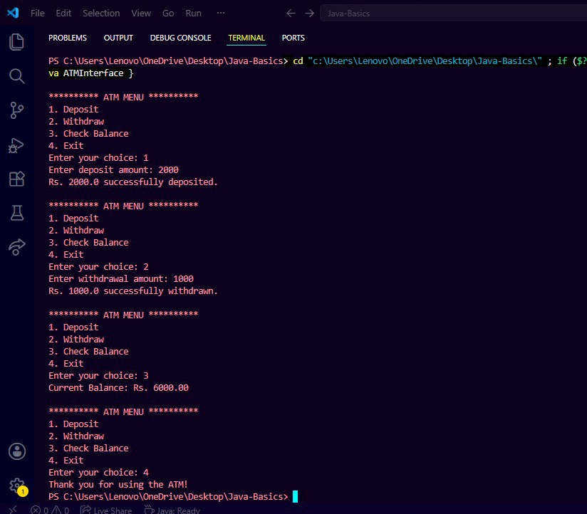
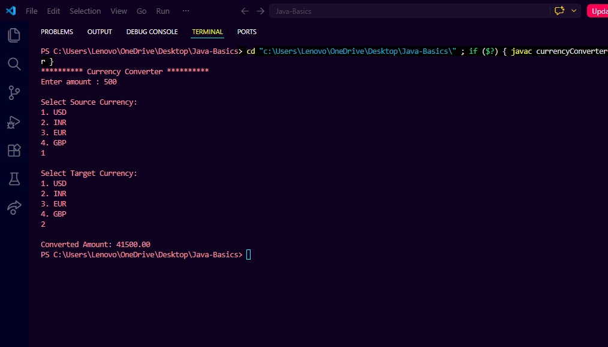

# DecodeLabs-Internship
# Java Internship Projects

This repository contains the projects that I completed during my Java Programming Internship. These projects helped me improve my understanding of Java fundamentals and gave me hands-on experience in developing console-based applications.

---

## Project 1: Number Game

### Description

The Number Game is a simple Java application where the computer generates a random number and the user tries to guess it. The program provides hints to help the user reach the correct answer.

### Features

* Random number generation
* User input through Scanner
* Hint messages for incorrect guesses
* Score calculation
* Multiple attempts

### Concepts Used

* Variables and Data Types
* Loops
* Conditional Statements
* Random Class
* User Input Handling

### Output

----------------------------------------------------------------------------------------------------------------------------------

## Project 2: Student Grade Calculator

### Description

The Student Grade Calculator is a Java program that calculates the total marks, average percentage, and grade of a student based on marks entered for multiple subjects.

### Features

* Accepts marks for multiple subjects
* Calculates total marks
* Calculates average percentage
* Assigns grades based on performance
* Displays results in a clear format

### Concepts Used

* Scanner Class
* Loops
* If-Else Statements
* Arithmetic Operations
* Type Casting

### Output

------------------------------------------------------------------------------------------------------------------------------------

## Project 3: ATM Interface

This repository contains my ATM Interface project developed using Java as part of my Java Programming Internship.

### Description

The ATM Interface is a console-based application that simulates basic ATM operations. Users can deposit money, withdraw money, check their account balance, and exit the application through a menu-driven interface.

This project helped me understand Object-Oriented Programming concepts and how real-world banking operations can be implemented using Java.

---

### Features

* Deposit money
* Withdraw money
* Check account balance
* Menu-driven interface
* Input validation
* Insufficient balance handling

---

### Concepts Used

* Classes and Objects
* Encapsulation
* Constructors
* Methods
* Loops
* Switch Case
* Conditional Statements
* Scanner Class

---

### Output

---
## Project 4: Currency Converter

### Description

The Currency Converter is a Java-based application that enables users to convert an amount from one currency to another using predefined exchange rates. The project provides a simple console-based interface where users can select source and target currencies and obtain the converted amount instantly.

### Features

* Convert currencies between USD, INR, EUR, and GBP
* User-friendly console interface
* Accurate currency conversion using predefined exchange rates
* Supports multiple currency selections
* Displays converted amount clearly

### Concepts Used

* Java Programming
* Scanner Class
* Variables and Data Types
* Conditional Statements (Switch Case)
* Arithmetic Operations
* User Input Handling
* Control Flow Statements

### Output

----

## Technologies Used

* Java
* JDK
* Visual Studio Code
* GitHub

---

## What I Learned

Through this project, I learned how to:

* Implementing program logic
* Using loops and conditional statements
* Building simple console-based applications
* Create and use classes in Java
* Implement encapsulation using private variables
* Handle user input using Scanner
* Build menu-driven applications
* Apply basic banking transaction logic

---

## Author

T.K. Charunetra

Java Programming Intern

